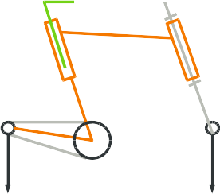
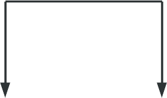

Qu'est-ce qu'un modèle ?
========================

Si triviale qu'elle paraisse, cette question n'est pas anodine : un modèle est évidemment une représentation de la réalité, certains points restent utiles à préciser.

Il existe une infinité de paradigmes de modélisation
----------------------------------------------------

On peut utiliser une variété de modèles pour décrire une même réalité. Par exemple, pour l'étude de sa trajectoire, une balle peut être réduite à un point, on utilisera les modèles de la mécanique du point ( $\vec{a} = \sum{(\vec{F})}$ par exemple). Pour plus de finesse, on considèrera son diamètre et sa rotation pour tenir compte d'effets aérodynamiques. Plus précisément encore, pour retranscrire la perte de moment cinétique de la balle, on introduira dans le calcul son inertie en rotation, ainsi qu'un modèle de frottement avec l'air, *etc*.

Pour représenter le même objet (une balle en mouvement), on peut évoquer ces trois modèles rapidement, et il paraît naturel que de nombreux autres existent, prenant en compte des paramètres supplémentaires, ou simplement différents.

De façon analogue, un même objet technique peut se représenter de multiples façons : schéma cinématique minimal, schéma technologique sont même des exemples très parlants, en cela qu'un même objet, selon le cadre de la réflexion, peut être représenté avec des niveaux de détail plus ou moins élevés, sans forcément rendre un modèle moins pertinent pour autant. Aucun des schémas représentant cette bicyclette (figures \ref{schem_comp} & \ref{schema_2}) n'est plus exact que l'autre, le niveau de détail n'ayant de sens que par rapport à l'usage qui sera fait par la suite du modèle.

Il est probable également que pour qui poursuit un objectif différent de l'interprétation mécanique, ces modèles seront parfaitement inutiles. Le logisticien en charge de la mise en conteneurs de bicyclettes ou le technicien de recyclage estimant la valeur des matériaux du produit n'en seront pas aidés.

Définition
----------

Compte tenu du lien étroit entre le modèle et le but qu'il sert à atteindre nous retenons les définitions suivantes.

Modèle :
:   Représentation partielle et exploitable de la réalité, confectionnée dans le but de répondre à une question ou une problématique.

Modélisation :
:   Action de construire un modèle associé à une problématique

Principes de base d'une démarche de modélisation
------------------------------------------------

Obtenir un modèle qui remplit effectivement sa fonction demande de procéder avec une certaine rigueur.

Écart "Modèle -- Réel":
:   Il existe par nature et par construction un écart entre la réalité et ce que chaque modèle peut en décrire. Les raisons en sont simples : la réalité est infiniment complexe à la fois dans sa structure et dans son comportement. Le but même de la modélisation est de limiter la complexité pour obtenir des résultats. Il est donc toujours incomplet par rapport à la réalité et ---dans un certain sens--- toujours faux.
    En marge des aspects qu'il appréhende et représente (souvent associés à des représentations mathématiques), un modèle élude obligatoirement un certain nombre d'aspects de la réalité. La qualité d'une démarche de modélisation dépend fortement de l'identification de ces aspects négligés au fur et à mesure de la modélisation, de façon à expliciter la portée du modèle.

Domaine de validité du modèle:
:   Chaque modèle est construit pour répondre à une problématique ou une famille de problématiques. Les limites de ce domaine où le modèle donne des résultats fidèles à la réalité sont la frontière de son *domaine de validité*. Il est donc important d'identifier ces limites, sous la forme de cas admissibles et non admissibles pour le modèle par exemple, ou de plages de valeurs où un modèle alternatif peut être substitué.

    On peut par exemple considérer les différents modèles de la gravité et de l'espace-temps. À des vitesses suffisamment faibles, la mécanique Newtonienne suffit dans l'immense majorité des cas ; alors que pour un corps à grande vitesse (comparable à la vitesse de la lumière) la relativité restreinte sera d'usage. Enfin pour certains cas ou plusieurs corps évoluent à des vitesses relatives importantes entre eux, la relativité générale sera utilisée\footnote{Le cas de la synchronisation des satellites GPS en est une application célèbre}.

Tenir compte de ces aspects tout au long de la modélisation permet au final de savoir à quelles questions le modèle permet (ou ne permet pas) de répondre.

Dans la variété de modèles et de paradigmes de modélisation existants, UML (actuellement en version 2) est remarquable car :

1. Il permet de décrire une grande variété de sujets
2. Il est adapté pour préparer des modélisations (notamment informatiques)
3. Il est lisible rapidement et constitue un outil de communication visuel univoque.

Pour ces avantages, c'est le paradigme et langage de modélisation qui est retenu dans de nombreuses formations, dont celle-ci.

La syntaxe UML est quasiment uniquement graphique, et s'appuie de façon cohérente sur les mêmes principes dans tous les types de diagrammes. Ceux-ci sont au nombre de 13:

* "Class diagrams",
* "Component diagrams",
* "Composite structure diagrams",
* "Deployment diagrams",
* "Package diagrams",
* "Object diagrams",
* "Activity Diagrams",
* "Communication diagrams",
* "Interaction Overview",
* "Sequence diagrams",
* "State machine diagrams",
* "Timing diagrams",
* "Use case diagrams".

Le plus courant de ces diagrammes est le diagramme de classe.

\newpage
