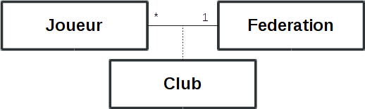
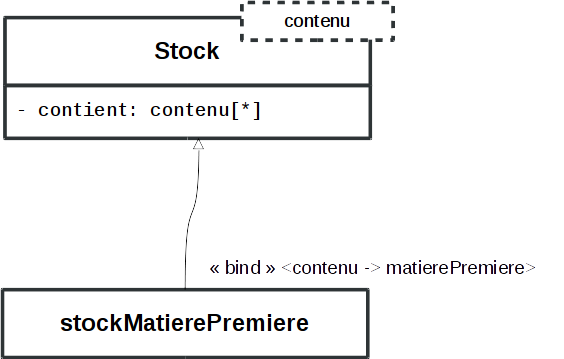

Diagrammes de classe UML 2
==========================

Base de la syntaxe UML 2
------------------------

UML est un langage graphique dans lequel une chose, quelle que soit elle, est décrite par un rectangle[^1] alors qu'un fait y est représenté dans un oblong.

[^1]: Qu'UML désigne sous le terme de *classifier*

Distinction entre classe et objet
---------------------------------

Distinguons d'abord une "classe" d'un "objet" : une classe est un concept, et peut être compris comme une catégorie, alors qu'un objet est un individu particulier.

En conséquence, en définissant une classe, le modélisateur propose de recenser et renseigner les aspects fondamentaux qui touchent tous les individus de cette classe. On parle alors des *instances* de la classe.

Par exemple, dans un modèle où existe une classe "Voiture", il peut exister autant d'objets qui seront instances de `Voiture` qu'il est nécessaire d'en représenter dans le modèle, la classe `Voiture` regroupera en une même entité leurs caractéristiques communes. Par contre, si des différences existent entre les différentes voitures du modèle, elles seront incluses dans les objets eux-mêmes.

Pour illustrer ces notions de classe et d'objet, on peut se figurer que toutes les personnes du monde sont des instances d'`ÊtreHumain`, présentant un nombre important de caractéristiques communes : tous sont dotés de deux géniteurs, de certaines capacités, etc. Les particularités individuelles au sein de cette catégorie `ÊtreHumain` sont de l'ordre des propriétés d'objets : ce sont des valeurs spécifiques au sein des possibilités offertes par la classe `ÊtreHumain`.

On considère en UML qu'un objet est toujours instance d'une ou plusieurs classes, les définitions des caractéristiques fournies par les classes sont appelées **attributs** et les valeurs spécifiques à un objet de ces attributs sont ses **propriétés**, ces termes différents existent pour limiter les confusions entre classe et objet.

Représentations
---------------

### Représenter une classe

Une classe est représentée par un classifier dans lequel le nom de la classe occupe le centre du compartiment le plus haut, et est (si possible) en gras. D'autres compartiments peuvent être ajoutés à l'envie. Ils servent à indiquer les attributs de la classe, ses *opérations* (ou *méthodes*), ou tout autre genre de capacité de cette classe.

méthode :
:   C'est une fonction fournie par une classe, et accessible dans chacune de ses instances. Utiliser une méthode d'un objet permet généralement d'appliquer les effets de cette méthode à l'objet en question.

### Indiquer les attributs {#attrib}

\label{attrib}
La représentation des attributs est conçue pour permettre de les écrire sur une ligne, ce qui la rend très compacte mais malheureusement assez peu lisible. On y fait figurer dans cet ordre:^[les termes utilisé dans cette description ne sont pas ceux de la norme]
\small

~~~
<visibilité> <dérivation> <nom> : <type> <multiplicité> <complément>
~~~

\normalsize

`<visibilité>` : est un symbole parmi `+`, `-`, `#`, et `~`, qui indique si l'attribut est public (`+`), privé (`-`), protégé (`#`), ou à visibilité limitée (`~`).

`<dérivation>` : est le symbole "`/`" si l'attribut découle (est évalué en fonction) d'autres ou est absent si l'attribut ne découle d'aucun autre.

`<nom>` : est le nom de l'attribut, obligatoirement suivi de "`:`"

`<type>` : est le type de l'attribut. Dans la plupart des cas, une implémentation ne peut être réalisée que si les types sont adaptés, et dépend fortement du choix des types. Notons dès à présent que Python fournit au programmeur des moyens d'ignorer ces limites, qui sont utiles surtout pour le programmeur expérimenté.

`<multiplicité>` : indique si un attribut peut être multiple. Si le type est un conteneur, il faut le faire suivre de crochets, qui contiennent le nombre de valeurs, `*` si leur nombre est variable. (exemple: `+tirage_loto:int[7]`) On indique entre les nombres minimaux et maximaux d'objets dans cette définition d'attribut (exemple: `œuf_contenu:Œuf[6..48]`).

`<complément>` : contient des informations complémentaires comme l'unicité des valeurs, le respect de l'ordre des objets, etc. ces informations sont entre accolades "`{}`", les termes utilisés habituellement sont "`unique`", "`ordered`", "`readOnly`", "`redefines`", "`subsets`", et "`union`".

### Exemples : {#exemples .unnumbered}

~~~
+ reference: str
~~~

Désigne un attribut nommé "reference", public, de type chaîne de caractères.

~~~
+ amis: Humain[*]
~~~

Désigne un attribut nommé "amis", public, constitué d'une liste d'objets de type `Humain`. La longueur de cette liste est indéterminée, de 0 à $\infty$.

### Indiquer les opérations

Une opération représente une capacité, une action qui est accomplie par les instances de la classe concernée.
Elle s'indique en une ligne dans le *classifier* sur un modèle semblable aux attributs :
\small

    <visibilité> <nom> (paramètres): <type de valeur renvoyée> <complément>

\normalsize

### Exemples : {#exemples .unnumbered}

L'opération décrite par la ligne suivante est publique, ne reçoit pas de paramètre, et retourne un objet de type `Rectangle`.

~~~
+ getSize(): Rectangle
~~~

Celle-ci ne renvoie aucune valeur, mais reçoit un argument (`in` est la "direction" du paramètre, en UML, et est facultatif).

~~~
+ setsize(in name: str): void
~~~

Enfin celle-ci est une opération statique de classe (ce qui est indiqué par le soulignement) et renvoie une liste de fenêtres alors qu'on lui passe un paramètre `sc` de type `Screen`:

\underline{\texttt{+ getOnScreen(sc: Screen): Window [0..*]}}

### Représenter un objet

Un objet est représenté comme une classe, dans un rectangle. Sa nature d'objet est indiquée par l'indication de son type (ou de sa classe) après "``:``", et le fait qu'il est souligné (quand le support le permet : parfois cet indication visuelle peut manquer).

### Relations
La définition des attributs décrite [en section \ref{attrib}](#attrib) est compacte, mais ne fait pas apparaître visuellement les liens entre objets. Les relations sont une autre notation qui permet de représenter avec plus de lisibilité les attributs, et qui permet d'autres indications.

Dépendance
:   : c'est la relation la plus faible. Elle indique qu'une classe (donc ses membres) utilise, interagit, ou a connaissance d'une autre. C'est souvent une relation volatile, c'est-à-dire que les classes n'interagissent que brièvement, sans garder de lien dans la durée.

Association
:   : au contraire de la dépendance, l'association est adaptée aux relation plutôt durables. Pour autant, l'existence des instances de ces classes n'est habituellement pas codépendante. Si la *navigabilité* est orientée (une flèche en indique la direction), elle indique une influence notable d'une classe sur les autres.

Agrégation
:   : plus forte que l'association, l'agrégation indique typiquement une relation de possession d'un élément par un autre.

Composition
:   : cette relation est encore plus forte, et peut en général se lire "fait partie de". En effet, elle représente la relation de la partie au tout ou du tout à ses parties. L'existence des objets liés est contrainte par cette relation. la destruction de l'objet possesseur cause la destruction de ses parties quasi-systématiquement.

Généralisation
:   : c'est le lien entre une classe et sa superclasse, c'est à dire d'un concept à un autre plus large englobant le premier.

Types spéciaux de classes
-------------------------

### Classe abstraite

Les classes abstraites décrivent des caractéristiques, par exemple des attributs ou méthodes, mais ne fournit pas d'implémentation pour celles-ci. Ce sont les sous-classes qui en fournissent les implémentations. Les classes abstraites n'ont donc pas d'instances hormis celles de leurs sous-classes.[^2]

On indique une classe abstraite par son nom, qui est en italique dans le *classifier*.

[^2]: python propose une implémentation des classes abstraites avec le module [`abc - Abstract Base Classes`][] (voir [@py3doc], sec. 29.7)

  [`abc - Abstract Base Classes`]: https://docs.python.org/3/library/abc.html#module-abc

### Classe d'association

La relation entre deux éléments est souvent plus qu'une simple connection structurelle. Une classe d'association permet de qualifier plus finement une association : comme toute autre classe, elle dispose d'un nom, d'attributs, etc. Il faut remarquer que si elle simplifie l'écriture du modèle, elle se traduit cependant généralement dans le code par trois éléments distincts : un pour chaque extrémité de l'association et un autre encore pour la classe elle-même.

### Modèles, `templates`

Les modèles de classes permettent de définir simplement la structure d'une classe quand de petites variations les distinguent. La figure \ref{template} montre la représentation préférentielle des templates, l'application de la template est indiquée par la notation \<\<`bind`\>\>.

Il existe également d'autres cas particuliers dans les diagrammes de classe UML 2 tels que les *association qualifiers*, ou les *interfaces*. La consultation d'un ouvrage de référence comme -@umlnut pourra fournir de plus amples informations si besoin.

Relations spéciales
-------------------

### Qualification d'associations
L'association entre deux éléments se fait souvent au travers d'un identifiant (unique par construction la plupart du temps). UML 2 permet de l'indiquer avec la syntaxe représentée en figure \ref{assoqualif}. Sur cette figure, on doit lire "Étant donné une entreprise et un numéro de sécurité sociale, il existe un ou aucun employé associé à l'entreprise". Il est impératif que ``Employé`` dispose de l'attribut listé.

Les associations qualifies ne sont pas garanties univoques dans toutes les versions d'UML 2 (notamment 2.4), il convient de les associer à un commentaire si un doute peut exister. Elles sont assez rarement utilisées.

### Interfaces
Les interfaces rappellent par certains aspects les classes abstraites : elles déclarent des attributs ou méthodes mais ne les implémentent pas. Il appartient à d'autre classes d'implémenter les interfaces. Dans les langages qui ne proposent pas l'implémentation d'interfaces (comme C++ ou python), on utilise pour les représenter des classes abstraites.

La représentation utilisant les cercles plutôt que les flèches est plus légère et réduit les confusions, elle est en général préférable pour les grands diagrammes de classes, la représentation fléchée convient mieux aux petits diagrammes.

\newpage
