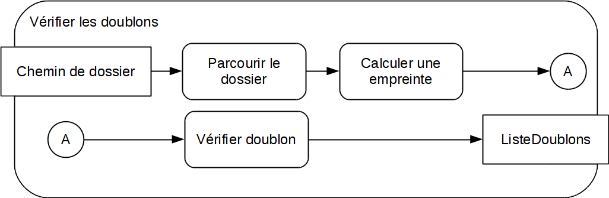
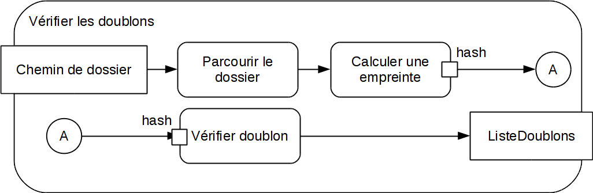

Diagrammes d'activité UML 2 (*Activity Diagram*)
==============================================

Alors que les diagrammes de classes permettent de décrire une structure avec UML, les diagrammes d'activité sont indiqués pour décrire *(ou spécifier)* le comportement d'un système, ou une procédure.

Les diagrammes d'activité UML décrivent une *"activité"* comme une succession d'*"actions"*. Cette partie donne les bases de la syntaxe graphique fournie par UML pour ces descriptions.

Représenter une activité
------------------------

Une activité se représente sous la forme d'un nœud UML aux angles arrondis^[Il s'agit d'une notion qui ne peut être considérée comme un objet, même intangible.]. Elle porte pour titre (en gras) le nom de l'activité, suivi éventuellement des paramètres de cette activité.
Les figures \ref{fig.budgeter} et \ref{fig.acti} donne un exemple d'activité.^[L'activité choisie pour l'exemple illustre assez bien comme les diagrammes d'activité sont probablement ceux qui peuvent être utilisés le plus facilement hors du domaine du génie logiciel]

Les paramètres sont indiqués en suivant la même convention de représentation que celle utilisée dans les diagrammes de classe, c'est à dire un par ligne, comme représenté sur la figure \ref{fig.cuisine}.

Détailler une activité
----------------------

On détaille une activité en représentant dans son cadre les "flux" ***d'actions*** qui les composent.

En reprenant l'exemple culinaire précédent, on peut par exemple (très qualitativement) proposer les actions décrites par la figure \ref{fig.cuis2}.

Parfois, une expression d'une action sous forme d'un extrait de code (ou de *pseudo code*) est plus explicite qu'une expression en plein texte. UML permet donc de décrire une action par un code ou pseudo code (fig. \ref{fig.pscode}).

Le diagramme précédent n'est pas tout à fait correct : l'action de "*tester*" serait mieux représentée par un nœud spécifique indiquant un choix. Ce nœud est représenté par un losange, comme c'est le cas dans les diagrammes décrivant des algorithmes.

Pour permettre de situer rapidement les points de départ et de fin des enchaînements d'actions, des nœuds initiaux et finaux peuvent (si c'est utile) être indiqués pour faciliter la lecture.

Ces deux types de nœuds sont présents sur le diagramme \ref{fig:15}.

Pré conditions, post conditions
-------------------------------

Si une activité ou action ne peut s'accomplir correctement que dans certaines circonstances, où altère l'état global de façon significative, il convient de l'indiquer.

Les **pré conditions** indiquent les conditions initiales impératives au début de l'activité, les ***post conditions*** l'état du système à la fin de l'activité ou de l'action.

Il convient d'indiquer les pré conditions ou post conditions des *actions* par le terme clé `<<<LocalPrecondition>>` ou `<<LocalPostcondition>>` dans un commentaire.

Informations complémentaires associées aux arêtes d'un graphe d'action
----------------------------------------------------------------------

Les arêtes dans une activité[^graction] sont des "flux d'objets" ^[*object flow* dans la spécification UML2]. On peut détailler les caractéristiques de ce flux en ajoutant un label à l'arête :

[^graction]: Qui n'est, en définitive, qu'un graphe dont les nœuds sont des actions.

-   `<<multicast>>` et `<<multireceive>>` identifient des flux / traitements parallèles
    -   `<<muticast>>` s'il existe plusieurs destinataires
    -   `<<mutireceive>>` s'il existe plusieurs expéditeurs
-   `<<selection>>` indique un filtrage des données
-   `<<transformation>>` indique une modification des données (une action convient souvent mieux)

Toutes ces informations complémentaires s'indiquent soit le long de l'arête elle-même, soit dans un commentaire qui lui sera attaché. Un exemple de `<<multicast>>` est présenté dans l'activité de téléchargement parallèle de la figure \ref{fig:17}.

Tokens dans les flux d'objets
-----------------------------

UML suppose une représentation des données en *tokens*: une unité de données, un objet, ou une activation sont représentés par un *token*.

Spécifier le "poids" (*weight*) d'une relation impose de *présenter* les données par groupes à l'acteur suivant dans le flux.

Nœuds des diagrammes d'activité
-------------------------------

### Nœuds d'objets^[*object nodes*]

On peut les lire comme des indications dans une arête, car ils indiquent la nature des objets qui suivent un flux.

### Nœuds de paramètres^[*parameter nodes*] et *pins*

Ces nœuds, positionnés sur la limite de l'activité, décrivent les objets à l'entrée et à la sortie d'une activité.

Les *pins* sont les équivalents des nœuds de paramètres, pour une action ou une activité dont on ne détaille pas le contenu.

Structures de contrôles dans les diagrammes d'activité
------------------------------------------------------

Les diagrammes d'activité décrivant des actions qui s'enchaînent, il est impératif de disposer de représentations pour les structures de contrôle : `if / elif / else`, et parallélisme des actions.

### Nœuds de décision

Ils traduisent une décision basée sur des tests : les conditions de choix sont indiquées entre crochets `[]`.

### Nœuds divergents et convergents

### Nœuds finaux

Il existe deux sorte de nœuds qui interrompent un flux d'actions.

#### Nœud de fin d'activité

<!---->

Représenté par un cercle noirci doublé, il interrompt toute execution dans l'activité ^[comme `return` en python] quand il est atteint.

#### Nœud de fin de flux

N'interrompt qu'une "ligne" d'actions sans interrompre toutes les actions de l'activité

\newpage
